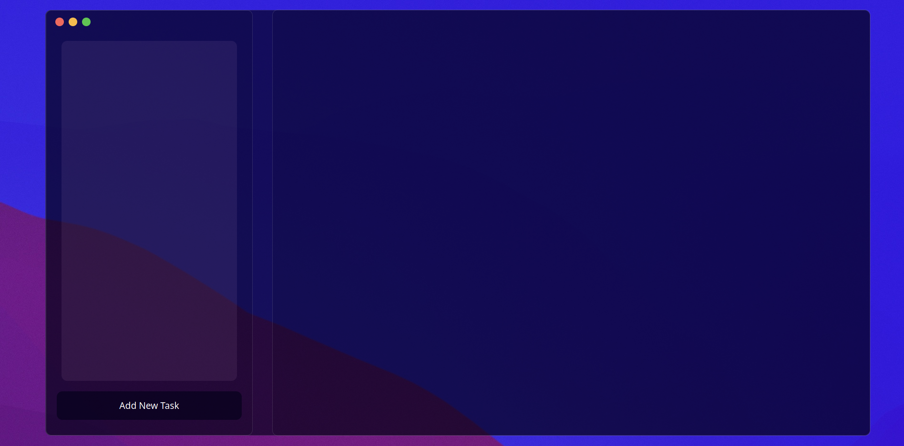
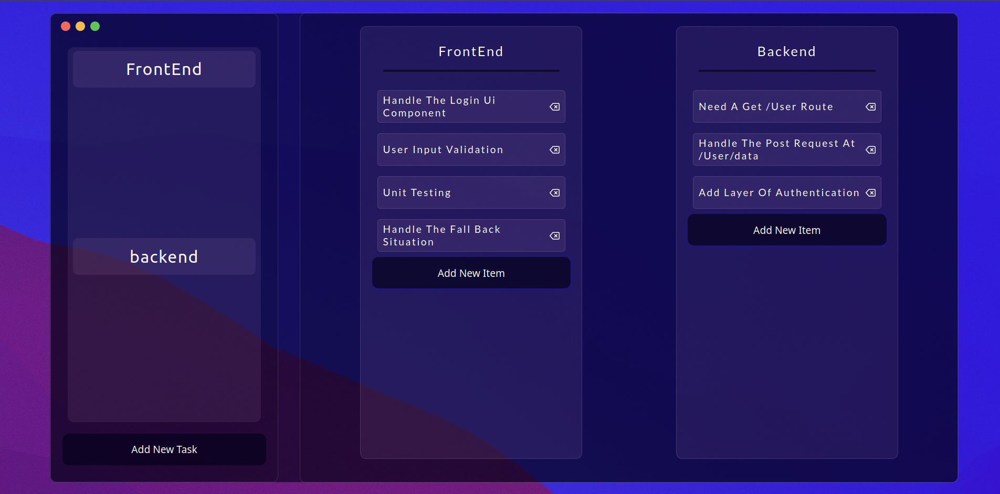
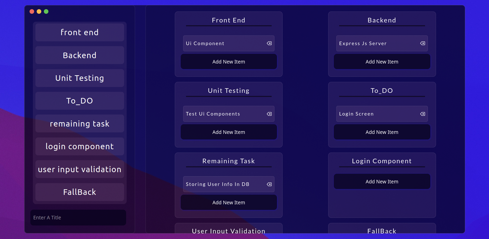

# Task Manager With Glassmorphism Design Effect

## You can manage all of your Task by creating task list and you can categorize your work in diffrent zone by giving a title to each task manager card.

**I have Used some of good tech in this projects**

***
**__About UserIntrerface and Desgn__**

Desing is Fully  Based On Glassmorphism and kind of glaasy Effect looks good when you intract wirh ui.
***
**__About Tech__**

* I have used React with Typescript for the Front-End
* Redux is used for state management

**__Some of Shots are Here__**

***
## It has great abilites like you can delete your tasks, you can give title and it is scrollable so high number of task would become not an issue.
**__How You Can use This__**
* Clone the repo
* `cd Directory`
* `npm install`
* `npm start`

